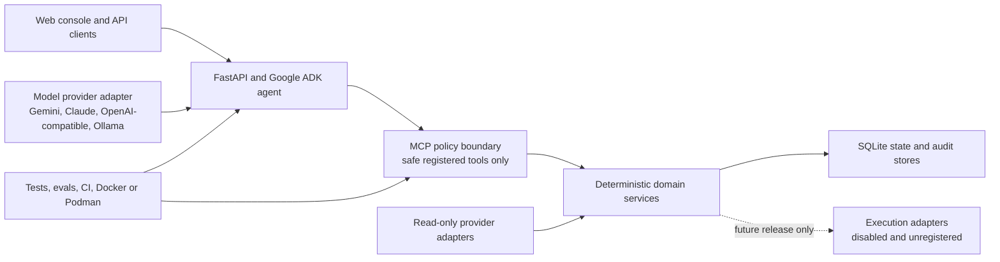
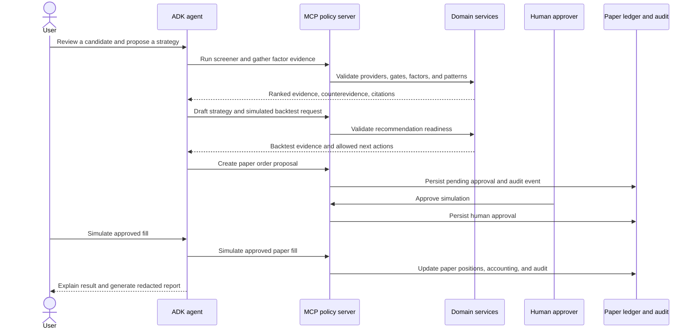

# TradePilot Sentinel Architecture

TradePilot Sentinel is a governed agentic trading workflow platform. The
current capstone release demonstrates the architecture with read-only data
access, deterministic analysis, strategy and backtest drafts, and
approval-gated paper simulation. Live execution is not implemented or exposed.

The presentation-ready architecture is available as a
[16:9 image](../capstone/media/slides/03-system-architecture.png) and in the
[capstone deck](../capstone/TradePilot-Sentinel-Capstone.pptx).

## Design Principle

The model coordinates intent and explanation. Deterministic services own
facts, scoring, readiness, permissions, persistence, and audit state.

## Runtime Components

| Component | Responsibility | Boundary |
| --- | --- | --- |
| React web console | Exposes screeners, strategies, approvals, reports, and provider settings | Calls the console API; does not implement trading policy |
| FastAPI agent service | Hosts the ADK agent and console endpoints | Coordinates tools and synthesizes responses |
| Google ADK agent | Routes intent through explicit workflow guidance | Cannot bypass MCP or domain policy |
| Model provider adapter | Selects Gemini by default and supports alternate hosted or local providers | Provider choice does not change tool permissions |
| MCP server | Publishes the least-privilege tool catalog | Forbidden tools are never registered |
| Domain packages | Own typed evidence, screeners, recommendations, backtests, ledger, reports, and provider contracts | Deterministic and testable without model credentials |
| SQLite stores | Persist paper ledger, market snapshots, provider profiles, and audit state | Contain no broker trading credentials |
| Eval and delivery pipeline | Runs deterministic tests, Agents CLI evals, container checks, and image publishing | Cloud credentials are optional for deterministic CI |

## Agentic Workflow

The corresponding presentation visual is
[05-agentic-workflow.png](../capstone/media/slides/05-agentic-workflow.png).

## Decision Intelligence

The screener and recommendation layers combine six evidence families:

- Technical: trend, momentum, volatility, and setup evidence.
- Fundamental: quality, value, growth, leverage, and revisions.
- Sentiment: news, investor, and contradiction signals.
- Volatility: VIX context, volatility regime, and risk multiplier.
- Macro: breadth, rates, event risk, and liquidity conditions.
- Portfolio fit: exposure, concentration, readiness, and risk state.

Provider contracts normalize these inputs. Deterministic hard gates run before
weighted scoring. Recommendations include counterevidence, uncertainty,
citations from read-only pattern cards, readiness state, and allowed next
actions. Structured facts remain authoritative; retrieval augments explanation
and does not control execution.

See [04-decision-intelligence.png](../capstone/media/slides/04-decision-intelligence.png)
and [product-data-pattern-foundation.md](../product/product-data-pattern-foundation.md).

## Action Tiers

| Tier | Examples | Authority |
| --- | --- | --- |
| `read_only` | Portfolio, screener, factors, provider health, reports | Agent may call the tool |
| `draft_only` | Strategy drafts, backtest requests, paper order proposals | Agent may create reviewable state |
| `approval_required` | Paper fill simulation and selected consequential changes | Human approval must already exist |
| `forbidden` | Live orders, live strategy enablement, broker token access, credential disclosure, approval bypass | Capability is not registered |

Policy is enforced by tool registration and domain checks, not solely through
the model instruction. Compatibility traps for forbidden actions exist only in
deterministic tests.

See [06-safety-model.png](../capstone/media/slides/06-safety-model.png) and the
[tool catalog](tool-catalog.md).

## Model And Platform Neutrality

Gemini is the capstone model provider through Google ADK. The model adapter also
defines Claude, OpenAI-compatible, and Ollama paths. Tool schemas, action tiers,
domain contracts, eval datasets, and the MCP server remain portable to Codex,
Claude Code, and generic MCP clients.

Provider neutrality is a deployment option, not a permission escape hatch. A
local or weaker model receives the same scoped tool catalog.

## Deployment

Docker Compose and Podman Compose start:

- Web console on port `3000`.
- FastAPI and ADK agent service on port `8000`.
- Streamable HTTP MCP server on port `8081`.
- Optional Ollama service through the `ollama` profile.

The services share a named volume for local SQLite state. CI runs contract and
security tests, agent-service tests, the web build, Compose validation,
container smoke checks, and an MCP safe-tool catalog assertion. CD publishes
images only for release tags or explicit manual dispatch.

## Current And Future Boundary

The capstone release ends at an approval-gated simulated fill. Future execution
adapters may be designed only after broker isolation, stronger approval models,
production audit review, observability, rollback, and release controls exist.
The current repository makes no claim that those controls or live execution are
implemented.
